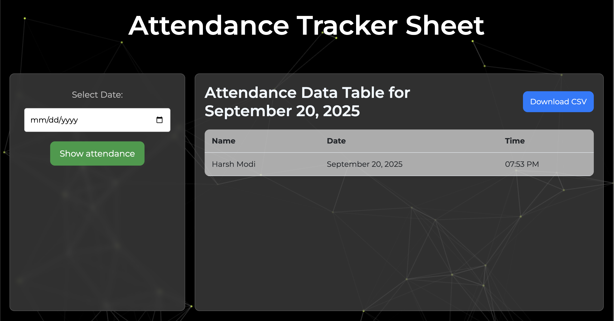

# ፊት Face Attendance System

A real-time attendance system built with Python that uses facial recognition to automatically mark attendance. The system captures faces, stores facial encodings, and recognizes individuals to log their attendance in a database.

 

---

## 🚀 Features

-   **User Registration:** Easily enroll new users by capturing their faces via a webcam using a Tkinter GUI.
-   **Facial Feature Extraction:** Processes registered face images to extract unique facial encodings using the `dlib` library.
-   **Real-time Recognition:** Marks attendance by recognizing registered faces from a live video stream.
-   **Attendance Logging:** Saves all attendance records with timestamps into an SQLite database.
-   **Simple UI:** A web-based interface (using Flask) to view the live feed and attendance log.

---

## 🛠️ Tech Stack

-   **Backend:** Python
-   **Facial Recognition:** `dlib`, `face_recognition`, `OpenCV`
-   **GUI/Web:** `Tkinter` (for face capture), `Flask` (for web interface)
-   **Data Handling:** `pandas`, `numpy`
-   **Database:** `SQLite`

---

## 📦 Project Structure

Here is an overview of the key files in this project:

```
├── data/
│   ├── data_dlib/                # Dlib's pre-trained models
│   └── data_faces_from_camera/   # Stores captured face images
├── templates/                    # HTML templates for Flask
├── app.py                        # Main Flask application to run the web UI
├── attendance_taker.py           # Core script for real-time face recognition
├── attendance.db                 # SQLite database to store attendance records
├── features_extraction_to_csv.py # Script to process images and save features
├── get_faces_from_camera_tkinter.py # GUI script to register new faces
└── requirements.txt              # Project dependencies
```

---

## ⚙️ Setup and Installation

Follow these steps to set up the project locally.

**1. Clone the repository:**
```bash
git clone https://github.com/modiharsh23/Face-Attendance-System-Flask.git
cd Face-Attendance-System-Project
```

**2. Create and activate a virtual environment:**
```bash
# For Mac/Linux
python3 -m venv venv
source venv/bin/activate

# For Windows
python -m venv venv
.\venv\Scripts\activate
```

**3. Install dependencies:**
*Note: Installing `dlib` can be tricky. You may need to install `CMake` and C++ development tools first.*
```bash
pip install -r requirements.txt
```

---

## ▶️ How to Run the System

**Step 1: Register New Faces**
Run the Tkinter GUI to capture images of a new person.
```bash
python get_faces_from_camera_tkinter.py
```

**Step 2: Update the Feature Encodings**
After adding new faces, run this script to process the images and update the `features_all.csv` file.
```bash
python features_extraction_to_csv.py
```

**Step 3: Start the Attendance System**
Run the main application to start the webcam and mark attendance.
```bash
python app.py
```
Now, open your web browser and go to `http://127.0.0.1:5000` to see the live video feed.